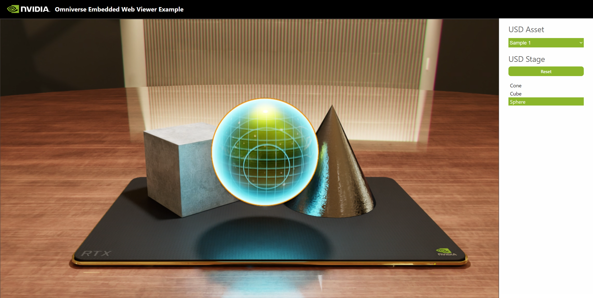

# Omniverse Web Viewer Sample Application

<p align="center">
  
</p>

This sample is part of the larger `Omniverse Embedded Web Viewer Example`.
The sample demonstrates how a front end client can present a streamed 
Omniverse Kit application and how to send messages back and forth between 
the two apps.

This application is designed to be used with the `USD Viewer Sample` in https://github.com/NVIDIA-Omniverse/kit-app-template.
The messages sent and handled by this sample expects the USD Viewer Sample. However, with some editing it can also be 
used to stream any other Kit application as well. 

This is a React application that has been build using the Vite 
framework (https://github.com/vitejs).


## Table of Contents
- [Prerequisites](#prerequisites)
- [Quick Start](#quick-start)
    - [Interacting with the solution](#interacting-with-the-solution)
- [Front End Client Development](#front-end-client-development)
  - [Embed Viewer in an Existing Client](#embed-viewer-in-an-existing-client)
  - [AppStreamer](#appstreamer)
  - [Initialize the Stream](#initialize-the-stream)
  - [Custom Messages with AppStreamer](#custom-messages-with-appstreamer)
  - [Sample Message Loop](#sample-message-loop)
- [Troubleshooting](#troubleshooting)
- [License](#license)
- [Contributing](#contributing)

## Prerequisites

- Node.js installation (https://nodejs.org/en/download).
- Chromium browser.

## Quick Start

Here we will run the solution in dev mode.

1. Make sure the prerequisites are fullfilled.

2. Make sure the appropriate Omniverse Kit application is running and streaming.

3. To run this front end client in dev mode, execute the following commands from the project root directory:

- `> npm install`
- `> npm run dev`

4. Open a Chromium browser and navigate to localhost:5173. At this point you should see the Kit application streamed into the web page.

### Interacting with the solution

The streamed RTX viewport within this client is interactable:

- Left mouse button click on the viewport to activate its interactivity by giving it focus.
- Left mouse button click to select something in the viewport.
- ALT + left mouse button drag to orbit with the camera.
- ALT + right mouse button drag to zoom.
- Middle mouse button drag to pan the camera.
- Hold right mouse button down for fly mode:
  - W: forward
  - A: left
  - S: reverse
  - D: right
  - Q: down
  - E: up
  - Use mouse scroll wheel to increase and decrease the camera speed

The `USD Asset` selector tells the streamed application which OpenUSD asset to load.

The `USD Stage` presents the contents of the OpenUSD asset.

- Select an item here and it also selects in the viewport.
- Select something in the viewport and this list shows what was selected.

## Front End Client Development

If this sample ticks all the boxes for what you want to develop then you are off to a good 
start. Simply make it your own and continue developing in it. However, it’s likely that you 
have an existing client that you want to embed the viewer into. 
In the section [Embed Viewer in an Existing Client](README.md#embed-viewer-in-an-existing-client) 
we provide instructions for how to add the `omniverse-webrtc-streaming-library` as a dependency. 
The library will provide pixel streaming and messaging to your client. The remainder of the topics 
here are presented in context of this sample so that it’s easy to follow along and try things out. 
Use this sample as a reference for implementing in your own client.

### Embed Viewer in an Existing Client

To embed the viewer in your existing client you’ll need to add the 
`omniverse-webrtc-streaming-library` as a dependency to your project:

 - Refer to [.npmrc](.npmrc).
 - Refer to [package.json](package.json) `dependencies` section.

### AppStreamer

The most important part of this sample is the [./src/AppStream.tsx](src/AppStream.tsx) file and its 
use of the `AppStreamer` class imported from the `omniverse-webrtc-streaming-library`. 
The `AppStreamer` is used for any implementation and `AppStream.tsx` is a reference implementation 
for initializing the stream and providing bi-directional messaging between the front end client 
and the Kit application.

#### Keyboard Event Management

The video HTML element presenting the streamed application reacts to keyboard and mouse
events in order to support camera movement, selection, and other 3D viewport interactions.
The `tabIndex` of the `<div>` wrapping the video element needs to have the tabIndex set to 
`tabIndex={0}` as seen in [./src/AppStream.tsx](src/AppStream.tsx). One - yes one - other interactive elements 
in the client also needs this tabIndex setting such as the selectable items in 
[./src/USDStage.tsx](src/USDStage.tsx). These tabIndex setting allows each element to receive
the right focus and interactivity. Without it you may find that only the viewport reacts to 
keyboard events.

### Initialize the Stream

The `AppStreamer`’s `setup()` function initializes the streaming and messaging. Here you provide a 
`streamConfig` object with configuration settings and a set of functions to handle messages.

This sample provides configuration via the [stream.config.json](stream.config.json) file. 
The default `source` is set to `local` which is the setting to use unless you are embedding a 
stream from [GDN](https://www.nvidia.com/en-us/omniverse/solutions/stream-3d-apps/).
For GDN you need to contact your NVIDIA representative and get the appropriate configuration details.

For `local` configuration in [stream.config.json](stream.config.json) you change the `server` 
to the ip address where the Kit application is streamed from. With the ip address set you can see how 
[AppStream.tsx](src/AppStream.tsx) constructs a `streamConfig` object providing a stream resolution and framerate:

```typescript
const server = this.props.streamConfig.server;
const width = 1920;
const height = 1080;
const fps = 60;
const url = `server=${server}&resolution=${width}:${height}&fps=${fps}&mic=0&cursor=free&autolaunch=true`;

streamConfig = {
   source: 'local',
   videoElementId: 'remote-video',
   audioElementId: 'remote-audio',
   messageElementId: 'message-display',
   urlLocation: { search: url }
};
```

It’s important to note that the "stream resolution” is the size of the Kit application. It is not the resolution 
in the Kit application viewport. By default, the USD Viewer template is set to change the viewport resolution to 
fit the size of the viewport; meaning, the resolution is adjusted as the application window is resized. 
If you want to add the ability to change the viewport resolution during an active session you could send a custom 
message from the front end client to request the change.

### Custom Messages with AppStreamer

There are two critical things to recognize when working with AppStreamer and custom messages:
- `AppStreamer.sendMessage()` lets you send a custom message.
- The `AppStreamer.setup()` function lets you register a handler for incoming messages via `onCustomEvent`:

```typescript
AppStreamer.setup({
   streamConfig: streamConfig,
   onUpdate: (message) => this._onUpdate(message),
   onStart: (message) => this._onStart(message),
   onCustomEvent: (message) => this._onCustomEvent(message)
})
```

#### Message Format

All custom messages exchanged between the front end client and the streamed Omniverse Kit application follows the same format:
an object with properties `event_type` and `payload` that is JSON stringified prior to being sent off.

```typescript
{
    event_type: "myEvent",
    payload: {
        property_name  : value
    }
}
```

On the receiving end, the Omniverse Kit application will need an Extension that handles `myEvent` and it's `payload`. The Kit
application sends similar messages for this client to handle. Below we explore how messages are used in this solution for
opening a USD stage,

#### Send a Custom Message

Messages sent by `AppStreamer` are strings. To make a message usable by your custom Kit Extension based on 
`omni.kit.livestream.messaging` usage you’ll need to comply with the message format stated above.
A practical and easy to read approach to do this is to first create an object:

```typescript
const message = {
  event_type: 'changeResolutionRequest',
    payload: {
      width: 2048,
      height: 1152
  }
}
```

Then use json to stringify the message object and ask AppStreamer to send it:

```typescript
AppStreamer.sendMessage(JSON.stringify(message));
```

This sample's [Window.tsx](src/Window.tsx) shows many examples of sending messages.

#### Receive a Custom Message

The function registered for custom events with `AppStreamer.setup()` should expect the same message object 
structure used to send messages.

```typescript
private _myCustomMessageHander (event: any): void {
    if (!event) {
        return;
    }
    if (event.event_type === 'changeResolutionConfirmation') {
        console.log('Resolution was changed in Kit app: ' + event.payload.resolution);
    }
}
```

This sample's [Window.tsx](src/Window.tsx) has a `_handleCustomEvent` that shows many examples of handling messages.

### Sample Message Loop

The below function from [Windows.tsx](src/Window.tsx) provides an example of sending a message to the streamed 
Omniverse Kit application. The client sends a `openStageRequest` with a `url` property in the `payload`.

```typescript
_openSelectedAsset = () => {
        ...
        const message: AppStreamMessageType = {
            event_type: "openStageRequest",
            payload: {
                url: this.state.selectedUSDAsset.url
            }
        };
        AppStream.sendMessage(JSON.stringify(message));
    }
```

The Kit application has a handler for `openStageRequest` that opens the USD asset with the provided `url`. Once that
asset has loaded the Kit application sends a `openedStageResult` which is handled by the client as shown below.

The `openedStageResult` handler to the request to open the asset can found in `src/Windows.tsx` as well:

```typescript
_handleCustomEvent = (event: any) => {
    ...
    // Streamed app notification of asset loaded.
    else if (event.event_type === "openedStageResult") {
        if (event.payload.result === "success") {
            console.log('Kit App communicates an asset was loaded: ' + event.payload.url);
            this._getChildren(null); // Hide progress indicator
        } else {
            console.error('Kit App communicates there was an error loading: ' + event.payload.url);
            this._toggleLoadingState(false); // Hide progress indicator
        }
    }
    ...
}
```

The `event_type` is used by both applications to triage how to handle a message. The `payload` is the data of the message.
This `payload` can contain whatever data is desired.

The above is a **custom capability of this example solution**. Developers should decide on what messages and payloads to
implement for their solutions.

## Troubleshooting

Things don't always turn out as expected. If you are not getting the expected results use the below steps to troubleshoot.

- Check the browser console for errors.
- Check the Kit application log for errors.
- Test with an unmodified version of the project to see if any changes may have created some problem.
- If you are streaming the Omniverse Kit application from another device, does the problem go 
away if you stream it on the same device that this front end client is running on? If so you may have a
network issue.
- Check if your browser was updated to a more recent version. Sometimes browsers are set to be auto 
updated. Does it work if you use an older version?
- Check the web browser log for errors.
- Check the Omniverse Kit application. Did something go wrong at the other end?
- Restart the solution:
  - Shut down the dev server. 
  - Shut down the Kit application. 
  - Start the Kit application. 
  - Start the dev server: `npm run dev`

## License

Development using the Omniverse Kit SDK is subject to the licensing terms detailed [here](https://docs.omniverse.nvidia.com/install-guide/latest/common/NVIDIA_Omniverse_License_Agreement.html).

## Contributing

We provide this source code as-is and are currently not accepting outside contributions.

